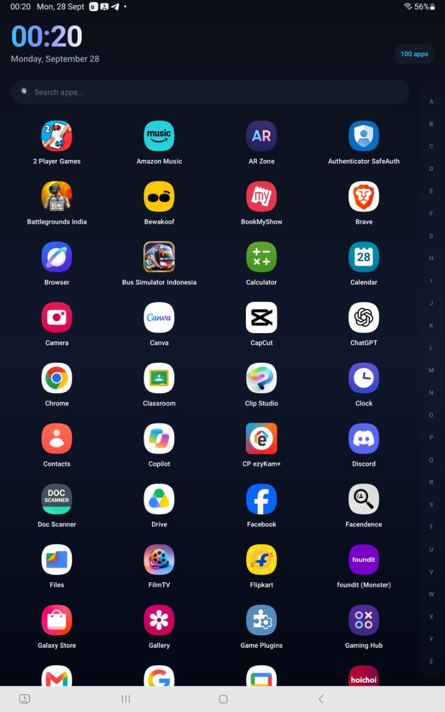
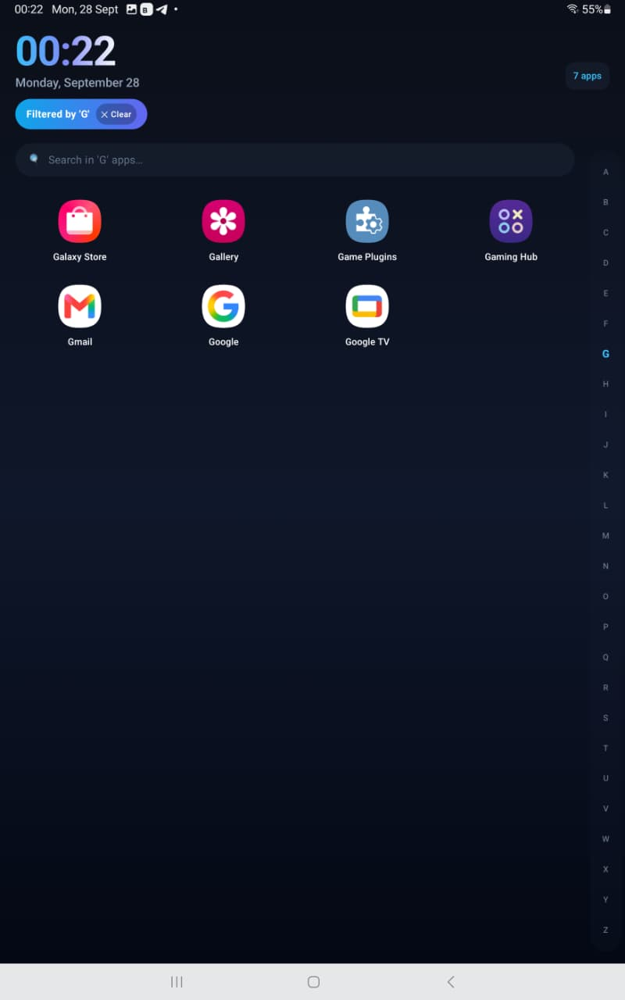
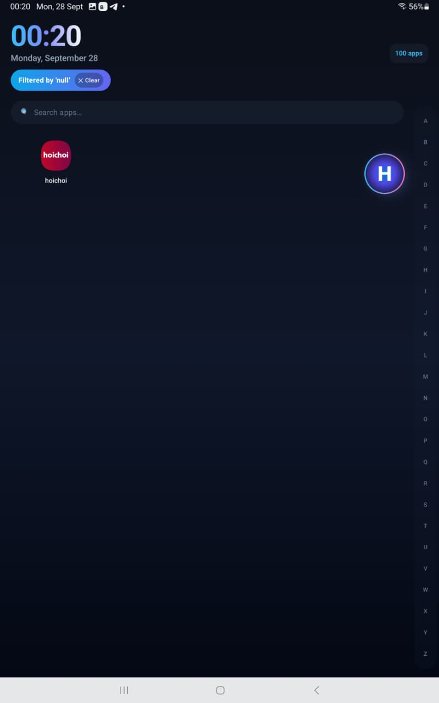
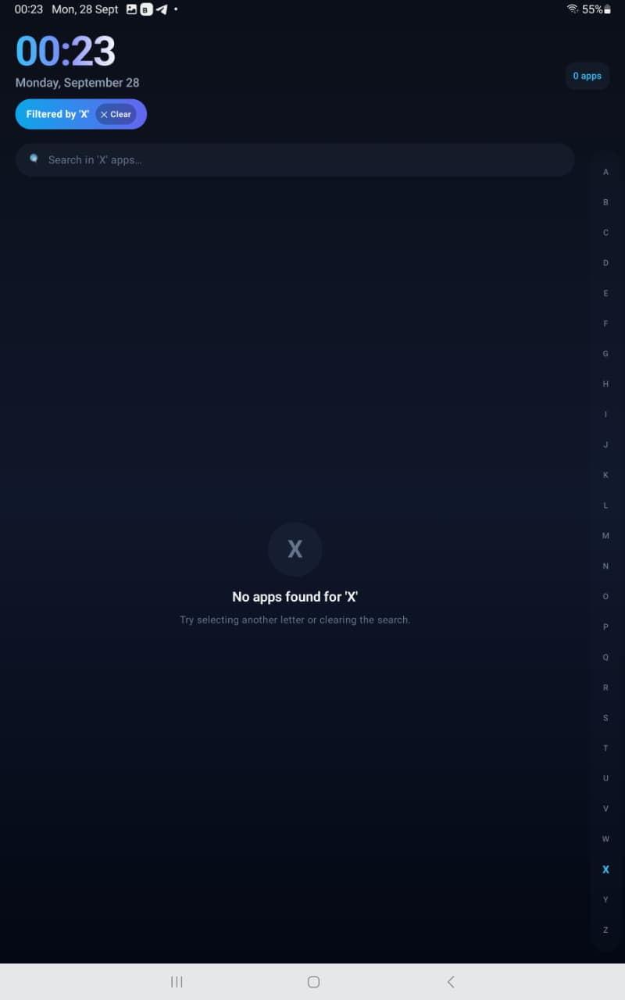
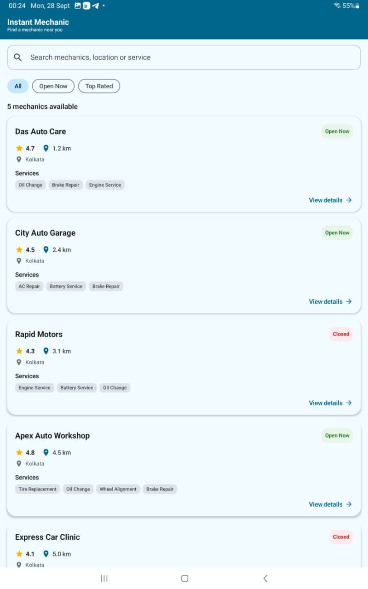

# Alphabet Launcher

A modern, high-performance Android launcher application built with **Kotlin** and **Jetpack Compose**. Featuring a clean digital clock header, real-time installed app detection, and an interactive **A-Z Alphabet Bar** with a curved fisheye arc touch animation, floating letter indicator, and fast in-memory app filtering.

---

## Features

- **Prominent Digital Home Screen**: Displays live system time (HH:mm) and date dynamically updating every minute, with an active app count indicator.
- **Real Installed Launchable Applications**: Detects all launchable apps installed on the Android device via `PackageManager` (with full support for Android 11+ / API 30+ package visibility).
- **A-Z Interactive Alphabet Bar**:
  - Vertical A-Z strip pinned to the right side supporting both **touch dragging** and **tapping**.
  - **Fisheye Arc Animation**: Mathematical distance-based arc transformation that enlarges touched letters and curves surrounding letters into a smooth horizontal arc.
  - **Selected Letter Bubble**: Floating circular indicator displaying the actively selected letter during touch interaction.
  - **Spring Release Animation**: Returns alphabet letters back to their default vertical positions smoothly upon touch release.
- **Instant In-Memory Filtering**:
  - Filters apps immediately when a letter is selected.
  - **Zero Repeated Queries**: Loads apps **once** into memory upon ViewModel initialization to guarantee 60 FPS touch dragging.
- **Empty State Display**: Displays a user-friendly message (`"No apps found for 'X'"`) when no installed apps match the selected letter.
- **One-Tap App Launching**: Taps launch the target application safely with fallback error handling.
- **Dark Glassmorphic UI**: Premium dark mode theme with glassmorphism cards, glowing accents, and smooth press micro-animations.

---

## Technologies Used

- **Language**: Kotlin 2.0
- **UI Framework**: Jetpack Compose (Material 3)
- **Architecture**: MVVM (Model-View-ViewModel) + Clean Data Layer
- **Async & State**: Kotlin Coroutines & `StateFlow`
- **System Integration**: Android `PackageManager` (`CATEGORY_LAUNCHER`, `QUERY_ALL_PACKAGES`)
- **Build System**: Gradle 8.13 with Kotlin DSL (`build.gradle.kts`)

---

## Architecture

The project follows clean architecture tailored for performance and maintainability:

```
com.anirudha.alphabetlauncher/
├── MainActivity.kt                 # ComponentActivity hosting Compose UI
├── data/
│   ├── AppInfo.kt                  # Data model for app label, package, icon & intent
│   └── AppRepository.kt            # Queries PackageManager asynchronously on Dispatchers.IO
├── viewmodel/
│   └── LauncherViewModel.kt        # Caches apps and exposes in-memory filtered StateFlows
└── ui/
    ├── LauncherScreen.kt           # Main composition layout combining components
    ├── ClockHeader.kt              # Prominent clock, date & active filter tag
    ├── AlphabetBar.kt              # Vertical A-Z bar with fisheye arc math & touch handler
    ├── SelectedLetterBubble.kt     # Floating circular letter indicator
    ├── AppList.kt                  # 4-column adaptive grid with empty state & search input
    ├── AppItem.kt                  # Single application item with press scale animation
    └── theme/                      # Glassmorphism dark color scheme & typography
```

---

## Technical Deep-Dive

### How Installed Apps Are Detected
Applications are loaded via `AppRepository.getLaunchableApps()` on `Dispatchers.IO`:
1. Constructs a launcher query intent:
   ```kotlin
   val mainIntent = Intent(Intent.ACTION_MAIN, null).apply {
       addCategory(Intent.CATEGORY_LAUNCHER)
   }
   ```
2. Queries `packageManager.queryIntentActivities(...)` considering API version differences (using `ResolveInfoFlags` on API 33+).
3. The `<uses-permission android:name="android.permission.QUERY_ALL_PACKAGES"/>` permission is declared in `AndroidManifest.xml` to grant full package visibility on Android 11+ (API 30+).
4. Application labels and icons are converted into `ImageBitmap` ahead of time to avoid expensive bitmap conversions during Compose rendering.
5. Sorted alphabetically by name using case-insensitive order.

### How A-Z Filtering Works
1. `LauncherViewModel` loads installed applications **once** during `init {}` into a `_allApps` state flow.
2. When the user taps or drags across the alphabet bar, `selectLetter(char)` updates the `_selectedLetter` state.
3. `filteredApps` is derived reactively via `combine(_allApps, _selectedLetter, _searchQuery)`:
   ```kotlin
   result = result.filter { app -> app.name.startsWith(letter, ignoreCase = true) }
   ```
4. **Performance Guarantee**: No `PackageManager` calls are ever performed while dragging across letters.

### How Curved Alphabet Interaction Works
The fisheye arc curve transformation in `AlphabetBar.kt` uses a mathematical distance formula:
1. Touch Y coordinate (`touchYPx`) is calculated via Compose `pointerInput(detectDragGestures)`.
2. For each letter $i$ with vertical center $y_i$, distance $d_i = |y_i - \text{touchYPx}|$ is evaluated.
3. Within a radius of influence $R = 130\text{dp}$:
   $$\text{curveFactor} = \cos\left(\frac{d_i}{R} \cdot \frac{\pi}{2}\right)$$
   $$\text{scale}_i = 1.0 + 1.1 \cdot \text{curveFactor}$$
   $$\text{offsetX}_i = - \text{maxArcOffset} \cdot \text{curveFactor}$$
4. When touch releases, target scale reverts to `1.0f` and offset to `0f`. Jetpack Compose `animateFloatAsState(spring(...))` smoothly animates letters back to normal vertical alignment.

---

## How to Build and Run the Project

### Prerequisites
- **Android Studio**: Jellyfish / Koala or newer (2024.1+)
- **JDK**: JDK 17, 21, or 24
- **Android SDK**: API 35 installed (Min SDK 26)

### Building via Command Line
```bash
# Clone or navigate to project directory
cd AlphabetLauncher

# Build Debug APK
./gradlew assembleDebug

# Output APK path:
# app/build/outputs/apk/debug/app-debug.apk
```

### Running on Device / Emulator
1. Open project in **Android Studio**.
2. Sync project with Gradle files.
3. Connect an Android Device or launch an Emulator (API 26+).
4. Press **Run** (`Shift + F10`) to deploy and test.

---

## Dependencies

- `androidx.core:core-ktx:1.13.1`
- `androidx.lifecycle:lifecycle-runtime-ktx:2.8.6`
- `androidx.lifecycle:lifecycle-viewmodel-compose:2.8.6`
- `androidx.activity:activity-compose:1.9.2`
- `androidx.compose.bom:2024.09.02` (UI, Material 3, Graphics, Tooling)

---

## Screenshots


### Home Screen


### Alphabet Interaction


### Filtered Apps


### Empty State


### App Launch


---

## Demo Video

[▶ Watch Alphabet Launcher Demo](https://drive.google.com/file/d/1hni6bf-rd04Jyk1C2q_Q-JXRDXD_wvx9/view?usp=drive_link)

---

## AI Usage Disclosure

This project was developed with assistance from Google Antigravity AI agent. The AI assisted with architecture design, Jetpack Compose UI layout implementation, pointer gesture handling, fisheye arc mathematical transformations, and Gradle setup.
